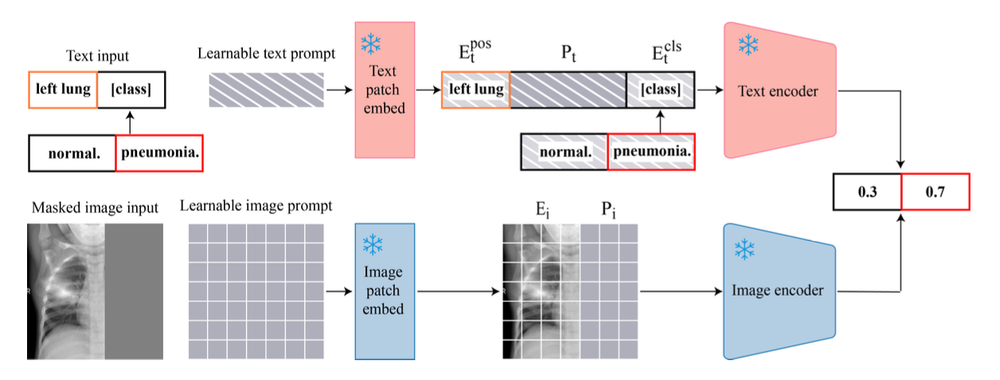
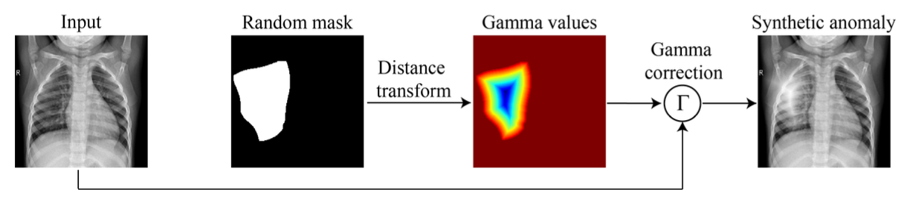

<p align="center">
  <h1 align="center"> Position-Guided Prompt Learning for Anomaly Detection in Chest X-Rays</h1>
  <p align="center">
Zhichao Sun, Yuliang Gu, Yepeng Liu, Zerui Zhang, Zhou Zhao, Yongchao Xu
  </p>
  <h3 align="center"><a href="https://arxiv.org/abs/2405.11976">Paper</a>
  <!-- <div align="center"></div> -->
</p>


## MICCAI-2024 (Early Accept)


[](LICENSE)
 
## Overview

We propose a Position-guided Prompt learning method for Anomaly Detection in chest X-rays (PPAD). PPAD leverages learnable text prompt and image prompt to minimize the gap between pre-training data and task-specific data. Through the position-guided prompts, the model can focus on various regions, simulating the diagnostic process of experts.

Furthermore, we propose a Structure-preserving Anomaly Synthesis method (SAS) in the training phase. 



## Table of Contents

- [Installation](#installation)
- [Dataset](#dataset)
- [Usage](#usage)
- [Model](#model)
- [Results](#results)
- [License](#license)
- [Citation](#Citation)

## Installation

Please follow the guide to install and set up the project.

```bash
# Clone the repository
git clone https://github.com/sunzc-sunny/PPAD.git

# Create conda environment
conda env create -f environment.yml
conda activate ppad
```
Please download the pre-training parameters of best_64_0.0001_original_35000_0.864.pt from CheXzero [Google drive](https://drive.google.com/drive/folders/1makFLiEMbSleYltaRxw81aBhEDMpVwno).

## Dataset

**ZhangLab Chest X-ray**  <br>
Please download the offical ZhangLab Chest X-ray benchmark from SQUID [Google drive](https://drive.google.com/file/d/1kgYtvVvyfPnQnrPhhLt50ZK9SnxJpriC/view?usp=sharing).

**Stanford ChexPert** <br>
Please download the offical Stanford ChexPert benchmark from SQUID [Google drive](https://drive.google.com/file/d/14pEg9ch0fsice29O8HOjnyJ7Zg4GYNXM/view?usp=sharing).

**VinDr-CXR** <br>
Please download the offical Med-AD benchmark from DDAD [Google Drive](https://drive.google.com/file/d/1ijdaVBNdkYP4h0ClYFYTq9fN1eHoOSa6/view?usp=sharing).  <br>
The Med-AD benchmark is organized using four public datasets, and VinDr-CXR is one of them.

## Usage
Update the dataset path and pre-trained parameters with your specified paths. <br>
Training the methods PPAD on datasets.
```bash
cd few_shot

python train_zhang.py      # Train PPAD on ZhangLab dataset
python train_chexpert.py  # Train PPAD on CheXpert dataset
python train_vincxr.py      # Train PPAD on VinDr dataset
```

Inference the method CheXzero on datasets.
```bash
cd zero_shot

python chexzero_zhang.py      # Test CheXzeor (baseline) on ZhangLab dataset
python chexzero_chexpert.py  # Test CheXzeor (baseline) on CheXpert dataset
python chexzero_vincxr.py      # Test CheXzeor (baseline) on VinDr dataset
```
Inference the method PPAD on datasets.
```bash
cd inference

python test_zhang.py       # Test PPAD on ZhangLab dataset
python test_chexpert.py   # Test PPAD on CheXpert dataset
python test_vincxr.py       # Test PPAD on VinDr dataset
```


## Model

PPAD on ZhangLab dataset [Google Drive](https://drive.google.com/file/d/1eRTXBucyzOTljPaxoXCiNRn5ZjAB837V/view?usp=sharing).<br>
PPAD on CheXpert dataset [Google Drive](https://drive.google.com/file/d/1ZT-qGSkkRseGw7aed2owrb8EOBVxFkO5/view?usp=sharing).<br>
PPAD on VinDr-CXR dataset [Google Drive](https://drive.google.com/file/d/1UYiR5PypW3j1mj0s3-4CIKC5uMcsuwI0/view?usp=sharing).

## Results

### Benchmark Results on ZhangLab and CheXpert Datasets


| Method                 |                   | ZhangLab Dataset |                      |                      | CheXpert Dataset  |                      | 
|------------------------|-------------------|------------------|----------------------|----------------------|-------------------|----------------------|
|                       | ACC (\%) ↑       | AUC (\%) ↑           | F1 (\%) ↑            | ACC (\%) ↑        | AUC (\%) ↑           | F1 (\%) ↑            |
| MemAE                 |   56.5 ± 1.1       | 77.8 ± 1.4           | 82.6 ± 0.9           | 55.6 ± 1.4        | 54.3 ± 4.0           | 53.3 ± 7.0           |
| SALAD                 | 75.9 ± 0.9       | 82.7 ± 0.8           | 82.1 ± 0.3           | -                 | -                    | -                    |
| CutPaste              |   64.0 ± 6.5       | 73.9 ± 3.9           | 72.3 ± 8.9           | 62.7 ± 2.0        | 65.5 ± 2.2           | 60.3 ± 4.6           |
| PANDA                   |  65.4 ± 1.9       | 65.7 ± 1.3           | 66.3 ± 1.2           | 66.4 ± 2.8        | 68.6 ± 0.9           | 65.3 ± 1.5           |
| M-KD                   | 69.1 ± 0.2       | 74.1 ± 2.6           | 62.3 ± 8.4           | 66.0 ± 2.5        | 69.8 ± 1.6           | 63.6 ± 5.7           |
| IF 2D                  | 76.4 ± 0.2       | 81.0 ± 2.8           | 82.2 ± 2.7           | -                 | -                    | -                    |
| SQUID                  | 80.3 ± 1.3        | 87.6 ± 1.5         | 84.7 ± 0.8             | 71.9 ± 3.8      | 78.1 ± 5.1            | 75.9 ± 5.7       |
| CheXzero* |   83.0             | 92.7                 | 87.5                 | 77.4              | 87.7                 | 79.7                 |
| Xplainer* |    78.2             | 89.9                 | 85.0                 | 75.6              | 83.6                 | 75.6                 |
| CoOp* |  84.6 ± 1.7       | 94.6 ± 1.1           | 88.6 ± 1.0           | 80.4 ± 1.8        | 87.0 ± 1.3           | 79.2 ± 2.2           |
| MaPLe* |  86.1 ± 1.0       | 95.1 ± 1.2           | 89.5 ± 0.5           | 79.5 ± 0.8        | 86.3 ± 1.0           | 79.6 ± 1.2           |
| PPAD         | 89.4 ± 0.6  | 96.7 ± 0.4       | 91.8 ± 0.5     | 82.7 ± 0.6    | 88.5 ± 0.9       | 82.0 ± 0.8       |

*Methods marked with an asterisk (\*) are reproduced in this work. Other results are either from their original paper or from SQUID. Mean and standard deviation are the results of five independent experiments.

### Benchmark Results on VinDr-CXR Dataset


| Method                         | CutPaste               | IGD            | AMAE               | Baugh et al.              | DDAD |
|----------------------------|-----------------------|--------------------|---------------------|---------------------------|---------------------------------|
|                           | AUC (\%) ↑            | AUC (\%) ↑           | AUC (\%) ↑         | AUC (\%) ↑                 | AUC (\%) ↑       |
|                           | 70.2             | 59.2                  | 74.2                | 76.6               | 78.2        |
|                           | AP (\%) ↑           | AP (\%) ↑              | AP (\%) ↑           | AP (\%) ↑                             | AP (\%) ↑        |
|                        | 69.8                   | 58.7                   | 72.9                | **78.4**                         | 74.6             |

| Method                        | CheXzero*                   | Xplainer*                | CoOp*       | MaPLe*               | PPAD |
|--------------------------|----------------------------------|-------------------------|---------------|---------------------|--------------------------------|
|                                 | AUC (\%) ↑                | AUC (\%) ↑              | AUC (\%) ↑      | AUC (\%) ↑         | AUC (\%) ↑  |     
|                         | 77.6                              | 76.5                     | 79.9 ± 2.1      | 74.2 ± 1.3         | 81.9 ± 0.9  |
|                         | AP (\%) ↑                         | AP (\%) ↑              | AP (\%) ↑         | AP (\%) ↑             | AP (\%) ↑   |    
|                       | 78.4                               | 78.2                      | 80.9 ± 2.1      | 75.7 ± 1.1            | **82.1 ± 1.1 |


*Methods marked with an asterisk (\*) are reproduced in this work. Other results are either from their original paper or from DDAD. Mean and standard deviation are the results of five independent experiments.


## License
This project is licensed under the MIT License

## Citation

